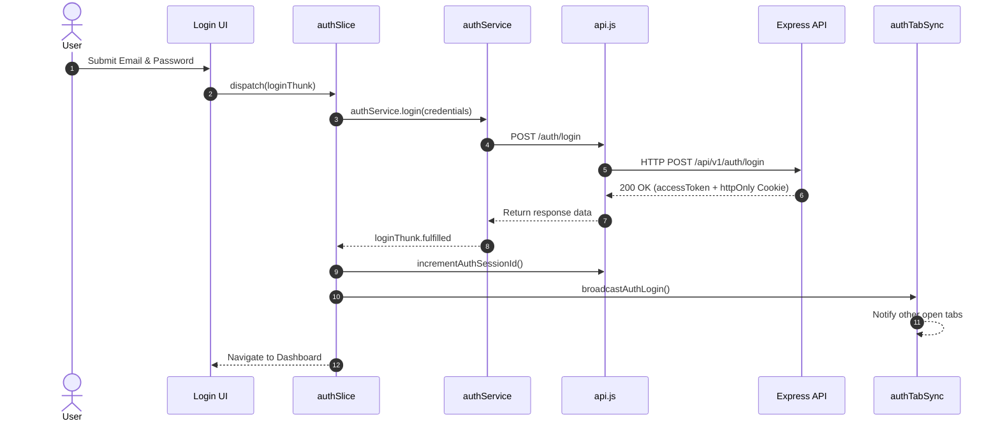
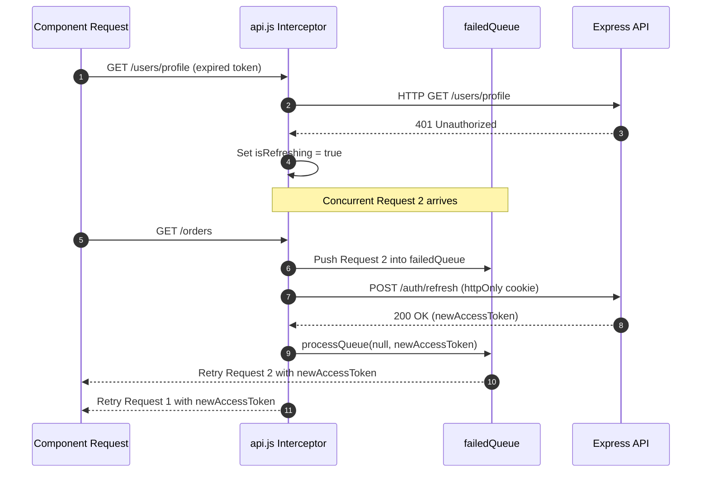
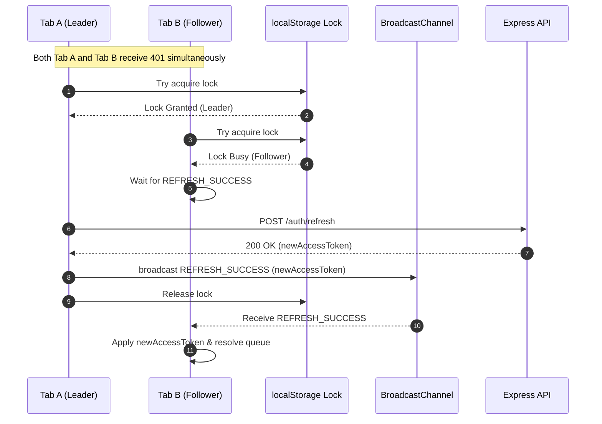
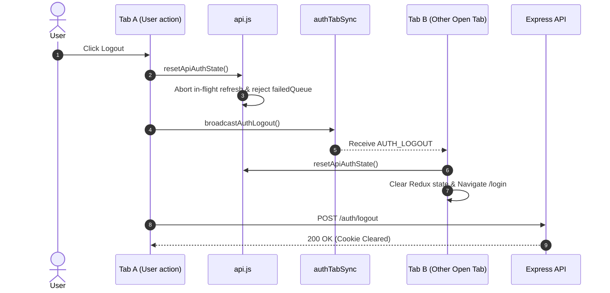

# PlateMate Authentication & Authorization Architecture

This document provides a comprehensive overview of the authentication, authorization, token lifecycle, cross-tab synchronization, and refresh leader election architecture in PlateMate.

---

## Table of Contents

1. [High-Level Architecture](#high-level-architecture)
2. [Authentication Flow](#authentication-flow)
   - [Login](#1-login)
   - [Access Token Management](#2-access-token-management)
   - [Automatic Token Refresh](#3-automatic-token-refresh)
   - [Logout](#4-logout)
3. [Role-Based Access Control (RBAC)](#role-based-access-control-rbac)
4. [Session Version Validation](#session-version-validation)
5. [Refresh Queue Management](#refresh-queue-management)
6. [Cross-Tab Synchronization](#cross-tab-synchronization)
7. [Refresh Leader Election](#refresh-leader-election)
8. [Logout Propagation & Precedence](#logout-propagation--precedence)
9. [Sequence Diagrams](#sequence-diagrams)
   - [Login Sequence](#login-sequence)
   - [Token Refresh & Queueing Sequence](#token-refresh--queueing-sequence)
   - [Multi-Tab Refresh Leader Election Sequence](#multi-tab-refresh-leader-election-sequence)
   - [Logout & Cross-Tab Invalidation Sequence](#logout--cross-tab-invalidation-sequence)
10. [Developer Debugging Guide (`authLogger`)](#developer-debugging-guide-authlogger)
11. [Security Assumptions & Known Limitations](#security-assumptions--known-limitations)

---

## High-Level Architecture

PlateMate uses a dual-token authentication model:

- **Access Token**: Short-lived JWT (15-60 minutes) stored in memory / `localStorage` and sent via the `Authorization: Bearer <token>` HTTP header.
- **Refresh Token**: Long-lived token (7 days) stored in a secure, `httpOnly`, `SameSite=Lax/Strict` cookie issued by the Express backend.

```
┌────────────────────────────────────────────────────────────────────────┐
│                              FRONTEND                                  │
│                                                                        │
│   ┌────────────────┐    ┌─────────────────┐    ┌───────────────────┐   │
│   │ Redux AuthState│    │ Axios Client    │    │ AuthTabSync       │   │
│   │ (authSlice)    │◀───│ (api.js)        │───►│ (BroadcastChannel)│   │
│   └────────────────┘    └─────────────────┘    └───────────────────┘   │
└──────────────────────────────────┬─────────────────────────────────────┘
                                   │ HTTPS
┌──────────────────────────────────▼─────────────────────────────────────┐
│                              BACKEND                                   │
│                                                                        │
│   ┌────────────────┐    ┌─────────────────┐    ┌───────────────────┐   │
│   │ Express Routes │───►│ Auth Middleware │───►│ Redis / PostgreSQL│   │
│   │ (/api/v1/auth) │    │ (authenticate)  │    │ (Tokens / Users)  │   │
│   └────────────────┘    └─────────────────┘    └───────────────────┘   │
└────────────────────────────────────────────────────────────────────────┘
```

---

## Authentication Flow

### 1. Login
- The user submits credentials via the `Login` page.
- Frontend dispatches `loginThunk(credentials)`, which posts to `/api/v1/auth/login`.
- Upon HTTP 200, the backend returns the `accessToken` in the JSON body and sets the `refreshToken` as an `httpOnly` cookie.
- `authSlice` saves `accessToken` to `localStorage` and updates Redux state (`isAuthenticated = true`, `user`).
- `incrementAuthSessionId()` bumps the local session version to invalidate any lingering refresh attempts from prior sessions.
- `broadcastAuthLogin(user)` notifies all other open browser tabs.

### 2. Access Token Management
- All outgoing API requests pass through the Axios request interceptor in `api.js`.
- If an `accessToken` exists in `localStorage`, it is attached as `Authorization: Bearer <token>`.

### 3. Automatic Token Refresh
- If an API request returns `401 Unauthorized`, the Axios response interceptor catches it.
- If the endpoint is not an excluded auth route (e.g. `/auth/login`), the request enters the token refresh pipeline.
- The tab attempts Leader Election (see section below). The elected leader tab sends `POST /api/v1/auth/refresh`.
- Upon success, the leader receives a new `accessToken`, updates `localStorage`, resolves queued requests, and broadcasts `REFRESH_SUCCESS` to follower tabs.

### 4. Logout
- When the user clicks Logout, `resetApiAuthState()` is invoked immediately.
- Any in-flight `/auth/refresh` request is aborted via `AbortController`.
- All pending queued requests in `failedQueue` are rejected.
- `broadcastAuthLogout()` propagates `AUTH_LOGOUT` across all open tabs.
- `authSlice` resets state and removes `accessToken` from `localStorage`.
- `authService.logout()` revokes the refresh token on the backend and clears the `httpOnly` cookie.

---

## Role-Based Access Control (RBAC)

Canonical User Roles:
1. `CUSTOMER` — Order food, manage profile/addresses/orders.
2. `PARTNER` — Manage restaurant, menu, categories, business hours, partner orders.
3. `RIDER` — Manage availability, view assigned deliveries, update delivery status, view earnings.
4. `ADMIN` — Platform administration, user/partner/rider overrides, system health.

Legacy Compatibility Layer:
- Roles `RESTAURANT` (alias for `PARTNER`) and `DELIVERY` (alias for `RIDER`) are supported temporarily during authorization checks in `ProtectedRoute.jsx` via `isRoleAuthorized()`.

Dashboard Resolution (`getDashboardRoute`):
- `CUSTOMER` → `/`
- `PARTNER` → `/partner/dashboard`
- `RIDER` → `/rider/dashboard`
- `ADMIN` → `/admin`

---

## Session Version Validation

To prevent race conditions during rapid login/logout or account switching:

- `currentAuthSessionId` counter is maintained in `api.js`.
- `capturedSessionId = currentAuthSessionId` is recorded when token refresh starts.
- Before applying the new `accessToken`, `api.js` verifies `capturedSessionId === currentAuthSessionId`.
- If a logout or user switch occurred during the HTTP call, the new token is discarded.

---

## Refresh Queue Management

When a token refresh is in progress (`isRefreshing = true`):

- Subsequent requests encountering `401` do not trigger duplicate refresh calls.
- Instead, they return a Promise pushed into `failedQueue`.
- Once refresh finishes, `processQueue(null, newAccessToken)` resolves all queued requests with the new token.
- If refresh fails or is cancelled, `processQueue(error, null)` rejects all queued requests.

---

## Cross-Tab Synchronization

Implemented in `authTabSync.js`:

- Primary Transport: `BroadcastChannel('platemate_auth_sync')`.
- Fallback Transport: Window `storage` event listening to `platemate_auth_event`.
- Event Types:
  - `AUTH_LOGIN`: Re-fetches user profile via `checkAuthThunk()` across all open tabs.
  - `AUTH_LOGOUT`: Triggers `resetApiAuthState()` and `logout()` in all open tabs.
  - `REFRESH_SUCCESS`: Distributes new access token to follower tabs.
  - `REFRESH_FAILURE`: Distributes refresh failure error to follower tabs.

---

## Refresh Leader Election

To prevent refresh storms across multiple open browser tabs:

1. When a 401 occurs, tabs inspect `platemate_refresh_lock` in `localStorage`.
2. The first tab to acquire the lock becomes the **Leader** (`tabId`, `expiresAt: Date.now() + 5000`).
3. Other tabs become **Followers** and wait for the leader's broadcast.
4. Only the Leader issues `POST /auth/refresh`.
5. Leader broadcasts `REFRESH_SUCCESS` with the new token; Followers attach the token and resolve queued requests.
6. **Fail-Safe**: Lock TTL is 5000ms. If the leader tab crashes, followers time out, clear the dead lock, and elect a new leader.

---

## Logout Propagation & Precedence

Logout operations take absolute precedence over all async auth tasks:

```js
resetApiAuthState()
```
Executes in order:
1. `refreshAbortController.abort()` — cancels in-flight HTTP refresh request.
2. `processQueue(logoutErr)` — rejects all queued requests so no retries occur.
3. `currentAuthSessionId++` — invalidates active session version ID.
4. `broadcastAuthLogout()` — notifies all open tabs.
5. Wipes `localStorage` and `Authorization` headers.

---

## Sequence Diagrams

### Login Sequence



### Token Refresh & Queueing Sequence



### Multi-Tab Refresh Leader Election Sequence



### Logout & Cross-Tab Invalidation Sequence



---

## Developer Debugging Guide (`authLogger`)

In development builds (`import.meta.env.DEV === true`), `authLogger` emits styled console logs under the `[AuthDebug]` prefix:

```
[AuthDebug] [LeaderElection] 12:34:56.789 - Elected as LEADER
[AuthDebug] [LockState] 12:34:56.790 - Lock acquired
[AuthDebug] [RefreshResult] 12:34:57.120 - SUCCESS (Leader)
[AuthDebug] [RequestQueue] 12:34:57.121 - Processing queue with new token (Queue size: 3)
[AuthDebug] [TabSync] 12:34:57.122 - Received event: REFRESH_SUCCESS
```

To filter auth logs in Chrome / Firefox DevTools:
- Type `[AuthDebug]` in the Console filter bar.

---

## Security Assumptions & Known Limitations

1. **Local Access Token Storage**: Access tokens are stored in `localStorage` for SPA persistence across refreshes. Ensure XSS protection (input sanitization, CSP headers) is maintained.
2. **Same-Origin Policy**: Cross-tab synchronization via `BroadcastChannel` and `localStorage` relies on browser Same-Origin Policy enforcement.
3. **Cookie Attributes**: Refresh tokens rely on `httpOnly`, `Secure` (in production), and `SameSite` cookies to prevent client-side JavaScript access and CSRF attacks.
